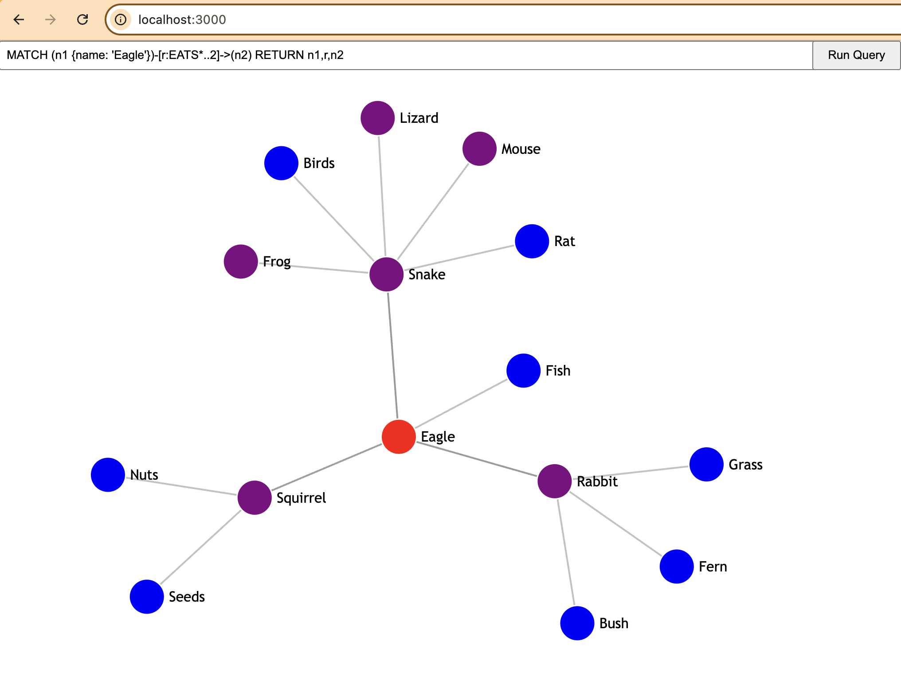

# iSchool Neo4j Project with D3

This repository is a set of starter files for the iSchool Neo4j project with [D3](https://d3js.org/). Specifically, we'll be creating a [disjoint force-directed graph](https://observablehq.com/@d3/disjoint-force-directed-graph/2), which beautifully arranges the nodes and relationships from Neo4j into the viewport.

### Get started:
1. Make sure you have [Node.js](https://nodejs.org/en/download) and [Git](https://git-scm.com/downloads) installed
2. Also, make sure you've got a Neo4j DBMS running. Using [Neo4j Desktop](https://neo4j.com/download/) is fine for this project, but you'll need to start the DBMS before you can send any queries to it from this app.
3. Clone the repository: `git clone https://github.com/RIT-iSchool/ganskop-neo4j-d3-project.git neo4j-d3-project`
4. Go into the repo directory: `cd neo4j-d3-project`
5. Install dependencies: `npm install`
6. Run the application: `node index.js`
7. View the app in your browser at: http://localhost:3000. 
If you have the 'animals' database loaded in Neo4j, you should be able to run the default example query that's prepopulated in the query field: 
 
Note that you can click and drag each of the nodes to rearrange portions of the graph.

### Customize:
Once you have the starter app running and you've populated a new Neo4j database with your own data, there are a few changes you'll need to make in the code:

* `index.js`
  * Update DBMS credentials, if needed (line 16)
  * Update database name (line 19)
* `public/index.html`
  * Remove the default query from the query field, or update it with a query that works for your own data (line 13) 
* `public/assets/css/styles.css`
  * Update the styling to, at minimum, reflect the node labels you're using in your data (beginning at line 36)
* `public/assets/js/graph.js`
  * There aren't actually changes that you *must* make to this file, but you should take a moment to grok what's going on in it. This file gets the Cypher query entered by the user, sends it to Neo4j, and then takes the result from Neo4j and uses D3 to render the graph in the browser.
* Have fun!
  * Once you've got a basic graph displaying with your own data, tweak the functionality and display to create an app that's truly your own